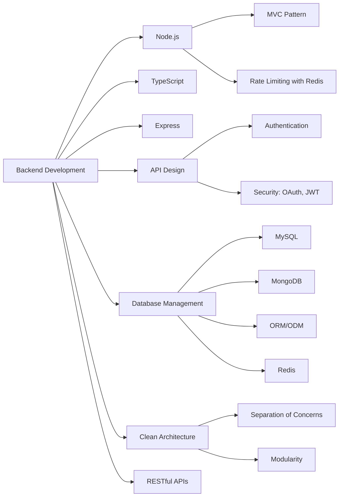

Hi 👋 My name is Luis Octavio
=============================

Backend Developer
-----------------

Soy ingeniero de software con enfoque en desarrollo backend, trabajando principalmente con tecnologias Node.js, TypeScript y Express.

* ✉️  You can contact me at [octaviodevtech@gmail.com](mailto:octaviodevtech@gmail.com)

### Skills

 
 
   
   
    
  
  
  
   
   
   
   
   
   

### Socials

 <a href="https://www.github.com/LOctavioDev" target="_blank" rel="noreferrer"> <picture> <source media="(prefers-color-scheme: dark)" srcset="https://raw.githubusercontent.com/danielcranney/readme-generator/main/public/icons/socials/github-dark.svg" /> <source media="(prefers-color-scheme: light)" srcset="https://raw.githubusercontent.com/danielcranney/readme-generator/main/public/icons/socials/github.svg" />  </picture> </a> <a href="https://www.linkedin.com/in/luis-octavio-lopez-martinez-56362a286/?trk=opento_sprofile_details" target="_blank" rel="noreferrer"> <picture> <source media="(prefers-color-scheme: dark)" srcset="https://raw.githubusercontent.com/danielcranney/readme-generator/main/public/icons/socials/linkedin-dark.svg" /> <source media="(prefers-color-scheme: light)" srcset="https://raw.githubusercontent.com/danielcranney/readme-generator/main/public/icons/socials/linkedin.svg" />  </picture> </a>

  
   
  
  

 

<b>Top Repositories</b>

       
