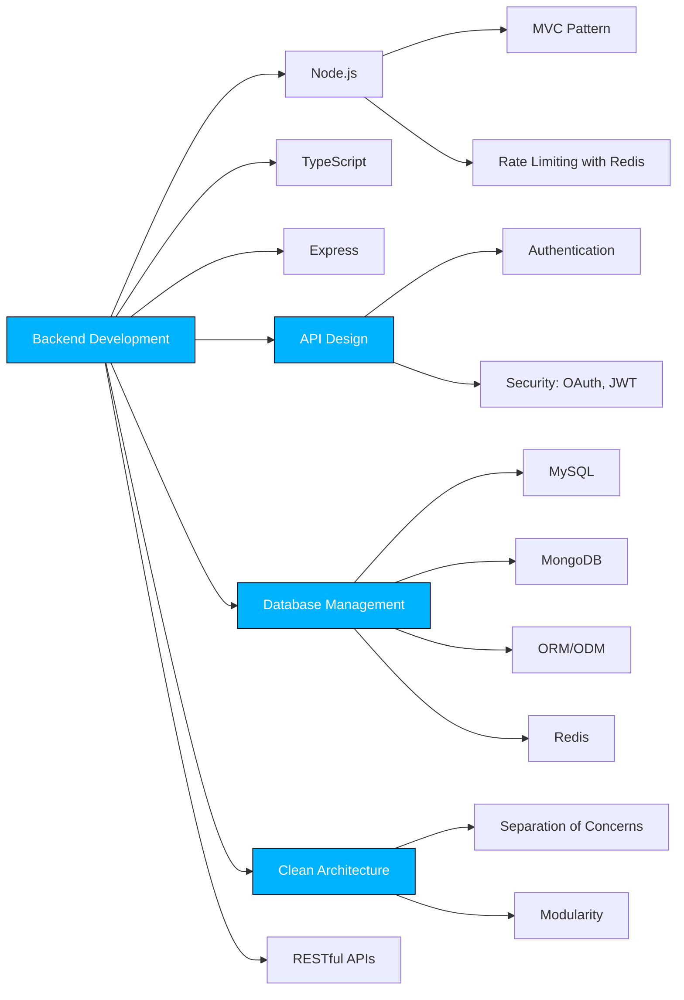

<div align="center">

<!-- Header with typing animation -->
<a href="https://git.io/typing-svg"></a>

<br/>

<!-- Badges -->
[](https://oct-portfolio.vercel.app/)
[](mailto:octaviodevtech@gmail.com)
[](https://www.linkedin.com/in/luis-octavio-lopez-martinez-56362a286/?trk=opento_sprofile_details)
[](https://www.github.com/LOctavioDev)

<br/>


</div>

##  About Me

```yaml
name: Luis Octavio
role: Backend Developer
location: Mexico 🇲🇽
focus: Building robust and scalable server-side applications
currently_learning: Clean Architecture & System Design
portfolio: https://oct-portfolio.vercel.app/
```

> Soy ingeniero de software con enfoque en desarrollo backend, trabajando principalmente con tecnologías **Node.js**, **TypeScript** y **Express**. Me apasiona construir APIs robustas, implementar patrones de diseño limpios y trabajar con bases de datos tanto SQL como NoSQL.

<br/>

## 🛠️ Tech Stack

<div align="center">

#### Backend & Runtime


#### Frontend


#### Databases


#### Tools & DevOps


</div>

<br/>


## 🏗️ Architecture & Expertise


```mermaid
graph LR
  A[Backend Development] --> B[Node.js]
  A --> C[TypeScript]
  A --> D[Express]
  A --> E[API Design]
  A --> F[Database Management]
  B --> G[MVC Pattern]
  B --> H[Rate Limiting with Redis]
  E --> I[Authentication]
  E --> J[Security: OAuth, JWT]
  F --> K[MySQL]
  F --> L[MongoDB]
  F --> M[ORM/ODM]
  F --> N[Redis]
  A --> O[Clean Architecture]
  A --> P[RESTful APIs]
  O --> Q[Separation of Concerns]
  O --> R[Modularity]

  style A fill:#00b3ff,stroke:#0d1117,color:#fff
  style O fill:#00b3ff,stroke:#0d1117,color:#fff
  style E fill:#00b3ff,stroke:#0d1117,color:#fff
  style F fill:#00b3ff,stroke:#0d1117,color:#fff
```

<br/>


## 📊 GitHub Stats

<div align="center">

<!-- Streak Stats (using the more reliable vercel fork) -->
<a href="https://git.io/streak-stats">
  
</a>

<!-- GitHub Stats -->
<a href="https://github.com/LOctavioDev">
  
</a>

<br/>

<!-- Top Languages -->
<a href="https://github.com/LOctavioDev">
  
</a>

</div>

<br/>

<!-- Activity Graph -->
<div align="center">
  <a href="https://github.com/LOctavioDev">
    
  </a>
</div>

<br/>


## 📌 Top Repositories

<div align="center">

<a href="https://github.com/LOctavioDev/backend-residencias">
  
</a>
<a href="https://github.com/LOctavioDev/test-api-fastapi">
  
</a>

</div>

<br/>


## 🌐 Connect with Me

<div align="center">

<a href="https://oct-portfolio.vercel.app/" target="_blank">
  
</a>

<a href="https://www.github.com/LOctavioDev" target="_blank">
  
</a>

<a href="https://www.linkedin.com/in/luis-octavio-lopez-martinez-56362a286/?trk=opento_sprofile_details" target="_blank">
  
</a>

<a href="mailto:octaviodevtech@gmail.com">
  
</a>

</div>

<br/>

<!-- Profile views counter -->
<div align="center">
  
</div>

<!-- Snake animation -->
<div align="center">
  <picture>
    <source media="(prefers-color-scheme: dark)" srcset="https://raw.githubusercontent.com/LOctavioDev/LOctavioDev/output/github-snake-dark.svg" />
    <source media="(prefers-color-scheme: light)" srcset="https://raw.githubusercontent.com/LOctavioDev/LOctavioDev/output/github-snake.svg" />
    
  </picture>
</div>

<div align="center">
  
</div>
